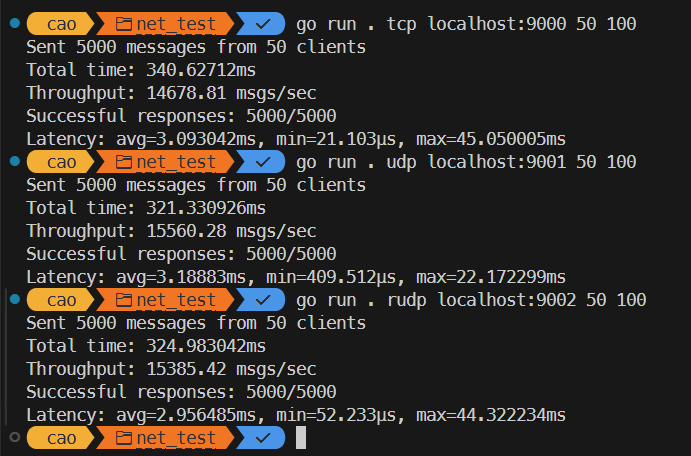

# Run server
`cd server && go mod tidy && go run .`

# Run test 
`go run . tcp localhost:9000 <client> <msg/client>`
`go run . udp localhost:9001 <client> <msg/client>`
`go run . rudp localhost:9002 <client> <msg/client>`

# Local result

# Server host on GCP VM result
